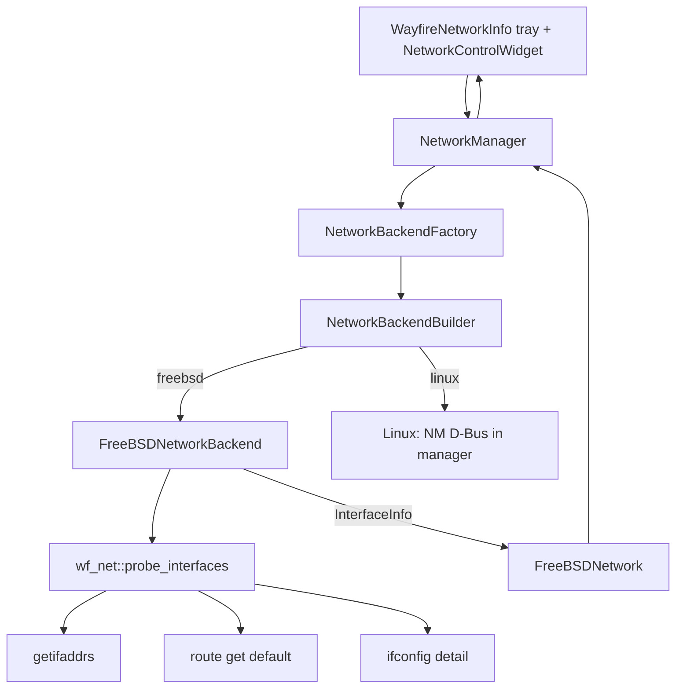
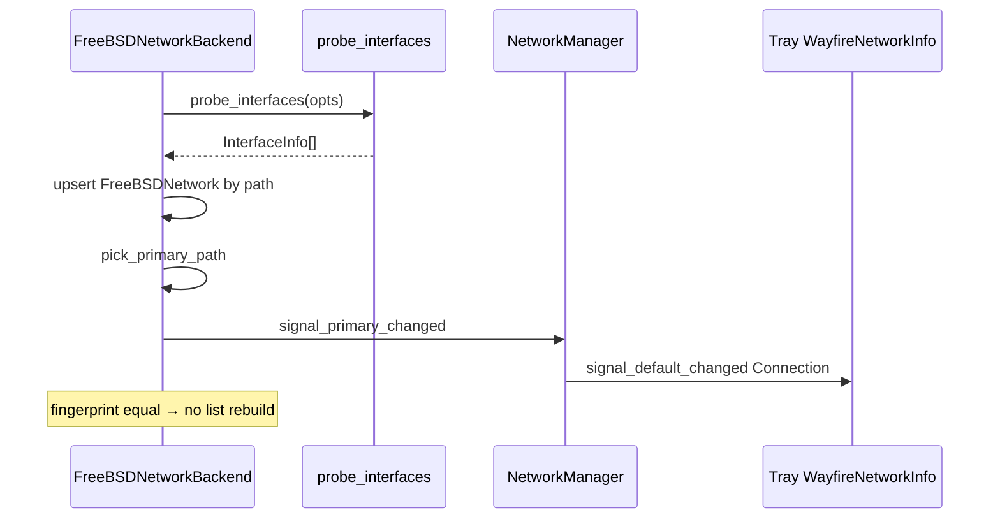
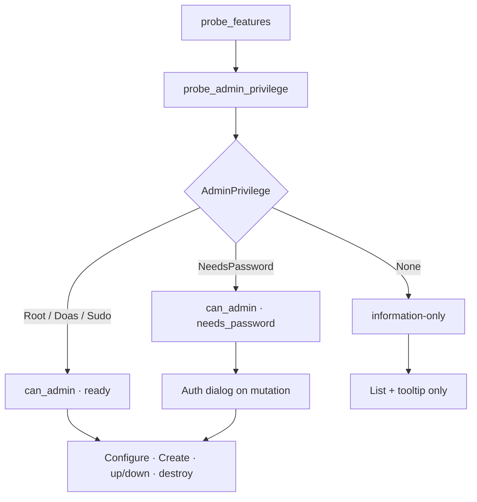
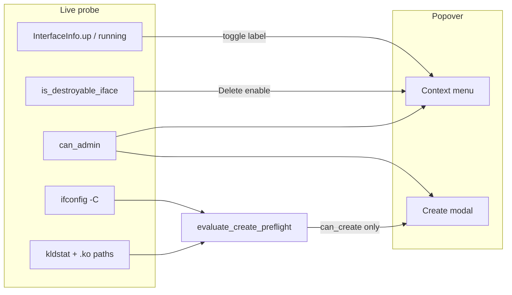
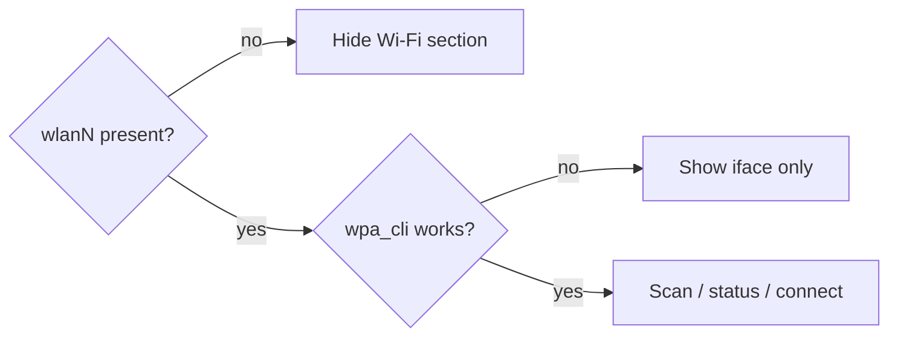

# Network backend architecture (Factory + Builder)

**Maintainer:** REVYTECH, Inc. · **Repo:** [revytechinc/wf-shell](https://github.com/revytechinc/wf-shell)  

**Orientation:** FreeBSD-first live probe. **NetworkManager is Linux-only.**  
Missing modules → hide panels — **never crash**.

---

## Patterns

| Pattern | Where |
|---------|--------|
| Factory Method | `NetworkBackendFactory::create()` / `Builder::build()` |
| Builder | `poll_interval_ms`, `include_virtual`, `include_bridge`, … |
| Abstract product | `NetworkBackend` (FreeBSD poll product vs null on Linux) |
| Domain types | `wf_net::InterfaceInfo`, `InterfaceKind`, `ProbeOptions` |
| Fail-soft | empty probe / no default route → null primary, quiet tray |
| Fingerprint | `interface_fingerprint()` before emit/rebuild |
| UI split | `NetworkControlWidget`: `setup_freebsd_ui()` vs `setup_linux_ui()` |

### Product matrix

| OS | Factory product | Orchestrator path | Popover UI |
|----|-----------------|-------------------|------------|
| **FreeBSD** | `FreeBSDNetworkBackend` | probe + primary signals only | iface list only — **no NM** |
| **Linux** | null poll backend | NetworkManager D-Bus | NM toggles, VPN, modem, “NM not running” |
| Other | null | quiet | empty |

---

## Class flow



---

## Source map (current / target)

| File | Role |
|------|------|
| `network-types.hpp/cpp` | Kind, display name, icon, CSS, fingerprint |
| `network-info.hpp/cpp` | FreeBSD probe + pure parsers + test hooks |
| `network-backend.hpp` | `NetworkBackend` + Builder + Factory API |
| `network-backend-factory.cpp` | OS branch |
| `freebsd-backend.cpp` | Poll product, primary signal |
| `freebsd-network.cpp` | Snapshot → `Network` |
| `manager.cpp` | Orchestration; FreeBSD vs D-Bus |
| `panel/widgets/network.cpp` | Tray widget |
| `network-widget.cpp` | Popover (still NM-shaped — rework to match mockup) |

---

## Probe → tray contract



---

## Privilege → information-only



Input validation (pure): `validate_iface_name`, `validate_ipv4/6_address`,
`validate_prefix_length`, `validate_config_form`, `validate_create_form`,
`validate_admin_password`.

---

## Right-click actions + Create preflight



**UI:** list only types with `can_create`; no module/command success text.  
**detail** on `CreatePreflight` is diagnostics (`module_unavailable`, …), not chrome.

| Pure (gtest) | Live probe | Apply (deferred) |
|--------------|------------|------------------|
| `is_destroyable_iface` | flags from `getifaddrs` | elevate + ifconfig |
| `evaluate_create_preflight` | `probe_create_preflight` | elevate + create |
| `parse_ifconfig_clone_list` | `ifconfig -C` | — |
| `kldstat_has_module` | `kldstat` | optional kldload |

Domain types: `CloneTypeInfo`, `CreatePreflight` in `network-types.hpp`.

---

## Wi‑Fi (v2, optional module)



---

## UI snapshots (SVG)

| Diagram | Content |
|---------|---------|
| [diagrams/tray-icon-only.svg](diagrams/tray-icon-only.svg) | Tray icon only |
| [diagrams/popover-interfaces.svg](diagrams/popover-interfaces.svg) | Interface list + Configure/Create |
| [diagrams/popover-context-menu.svg](diagrams/popover-context-menu.svg) | Right-click actions |
| [diagrams/modal-configure.svg](diagrams/modal-configure.svg) | Address editor modal |
| [diagrams/modal-create-preflight.svg](diagrams/modal-create-preflight.svg) | Create (available types only) |
| [diagrams/modal-auth-password.svg](diagrams/modal-auth-password.svg) | Password when elevator needs it |
| [diagrams/information-only.svg](diagrams/information-only.svg) | No admin privileges |

Interactive twin: [mockup.html](mockup.html).

---

## Tests

```sh
meson test -C build --suite unit   # includes network-backend-test
# Line coverage of pure/probe units (like audio):
docs/network-control/tests/coverage.sh
```

**Covered (~96% of pure/probe .cpp):** classify, display/icon/css, fingerprint,
destroyable, clone/preflight, input validation, route/ifconfig parse, primary pick,
admin privilege + create preflight via `InfoHooks`, FreeBSDNetwork snapshot, factory.

**Not unit-covered (integration):** `network-widget.cpp`, `manager.cpp` NM D-Bus,
panel tray chrome. Residual misses: `geteuid()==0`, popen/getifaddrs hard failures.
