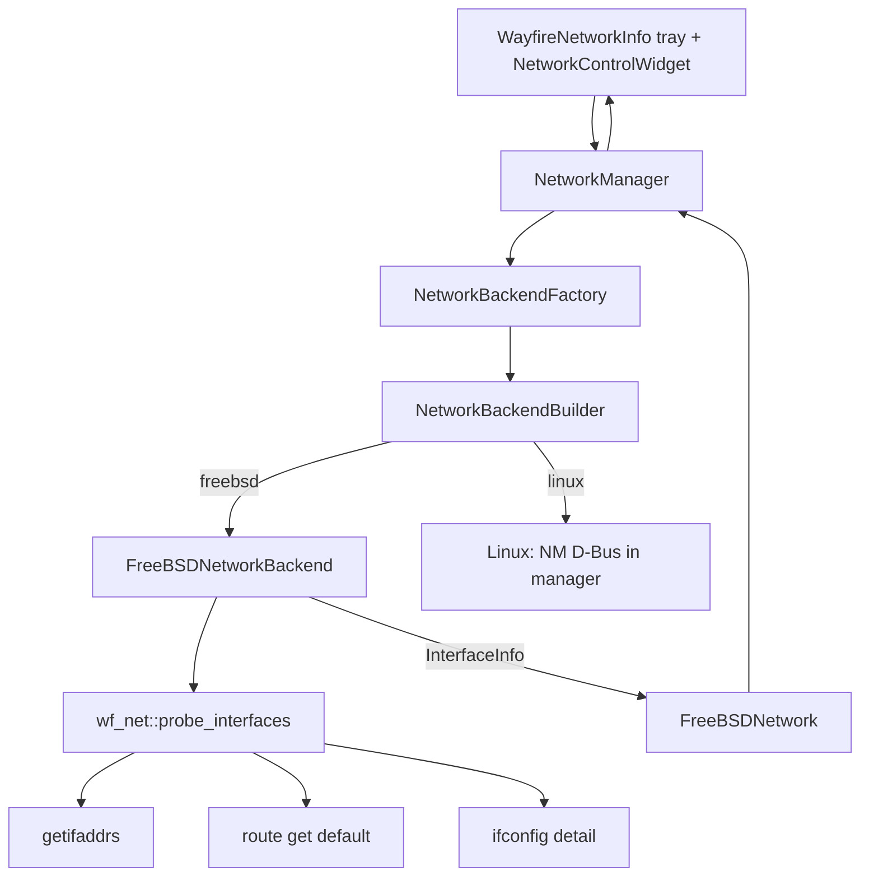

# Network backend architecture (Factory + Builder)

**Maintainer:** REVYTECH, Inc. · **Repo:** [revytechinc/wf-shell](https://github.com/revytechinc/wf-shell)  

**Orientation:** FreeBSD-first live probe. **NetworkManager is Linux-only.**  
Missing modules → hide panels — **never crash**.

---

## Patterns

| Pattern | Where |
|---------|--------|
| Factory Method | `NetworkBackendFactory::create()` / `Builder::build()` |
| Builder | `poll_interval_ms`, `include_virtual`, `include_bridge`, … |
| Abstract product | `NetworkBackend` (FreeBSD poll product vs null on Linux) |
| Domain types | `wf_net::InterfaceInfo`, `InterfaceKind`, `ProbeOptions` |
| Fail-soft | empty probe / no default route → null primary, quiet tray |
| Fingerprint | `interface_fingerprint()` before emit/rebuild |
| UI split | `NetworkControlWidget`: `setup_freebsd_ui()` vs `setup_linux_ui()` |

### Product matrix

| OS | Factory product | Orchestrator path | Popover UI |
|----|-----------------|-------------------|------------|
| **FreeBSD** | `FreeBSDNetworkBackend` | probe + primary signals only | iface list only — **no NM** |
| **Linux** | null poll backend | NetworkManager D-Bus | NM toggles, VPN, modem, “NM not running” |
| Other | null | quiet | empty |

---

## Class flow



---

## Source map (current / target)

| File | Role |
|------|------|
| `network-types.hpp/cpp` | Kind, display name, icon, CSS, fingerprint |
| `network-info.hpp/cpp` | FreeBSD probe + pure parsers + test hooks |
| `network-backend.hpp` | `NetworkBackend` + Builder + Factory API |
| `network-backend-factory.cpp` | OS branch |
| `freebsd-backend.cpp` | Poll product, primary signal |
| `freebsd-network.cpp` | Snapshot → `Network` |
| `manager.cpp` | Orchestration; FreeBSD vs D-Bus |
| `panel/widgets/network.cpp` | Tray widget |
| `network-widget.cpp` | Popover (still NM-shaped — rework to match mockup) |

---

## Probe → tray contract

1. `probe_interfaces(opts)` → vector of `InterfaceInfo`  
2. Backend upserts `FreeBSDNetwork` by `path` (`/freebsd/interfaces/<name>`)  
3. `pick_primary_path` → default-route iface if up  
4. `signal_primary_changed` → `Connection{device}` → tray `set_connection`  
5. Device list fingerprint equal → **no** full popover rebuild  

---

## Wi‑Fi (v2, optional module)

When `wlanN` exists and `wpa_cli -i wlanN status` works:

- Status: ssid, ip, wpa state  
- Scan: `wpa_cli scan` / `scan_results`  
- Connect: `wpa_cli` network add / enable (details in implementation PR)  

Absent → section not built (features flag).

---

## Tests

```sh
meson test -C build --suite unit   # includes network-backend-test
```

Pure: classify, route parse, ifconfig media parse, primary pick.  
Live FreeBSD: probe non-empty + default route (host-dependent).
