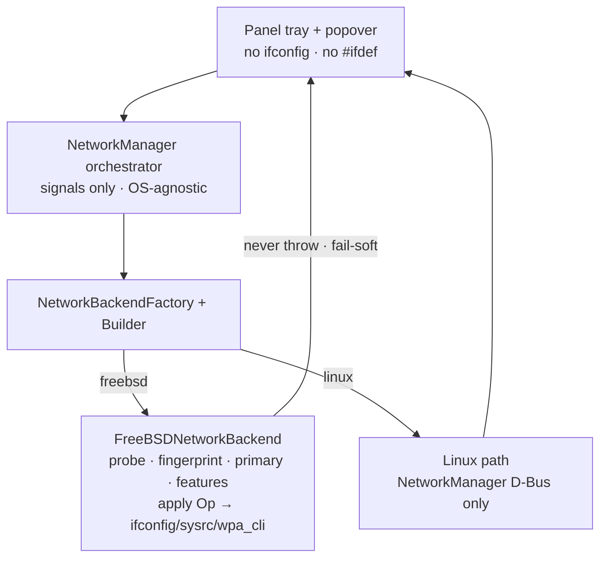
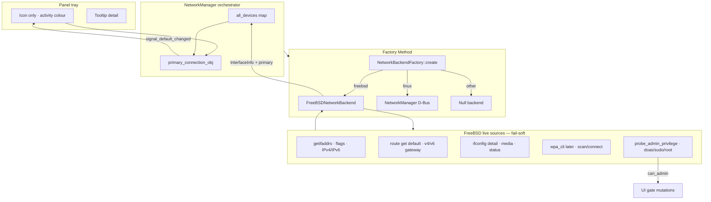
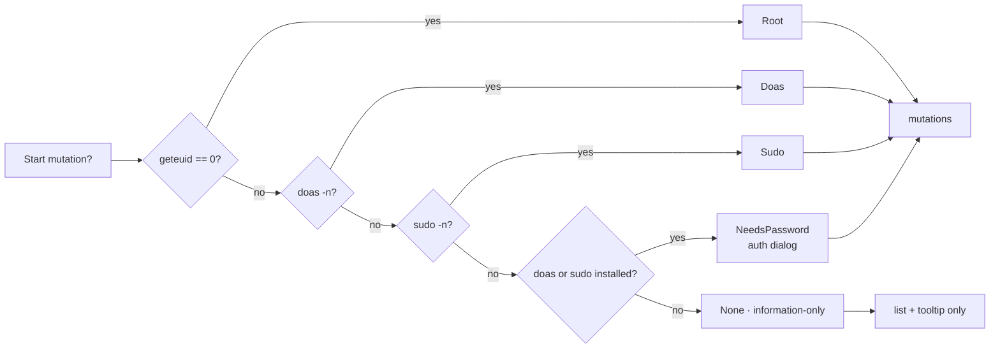
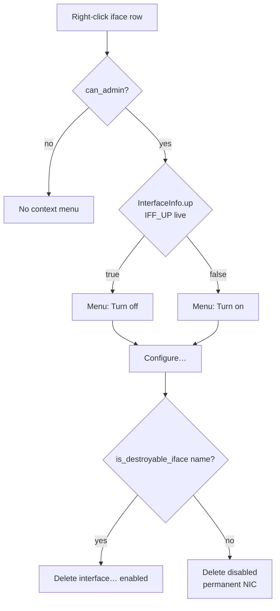
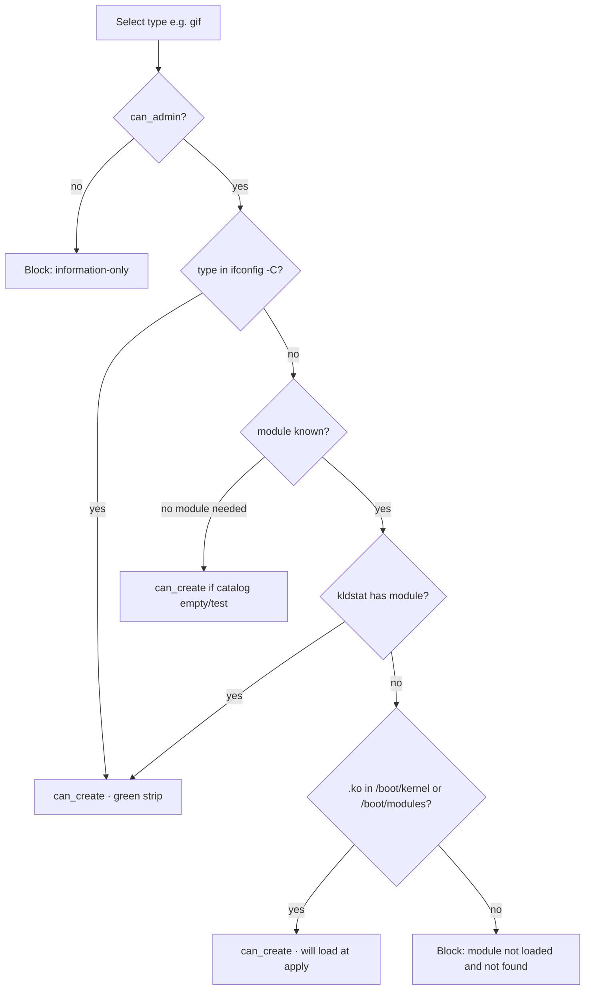
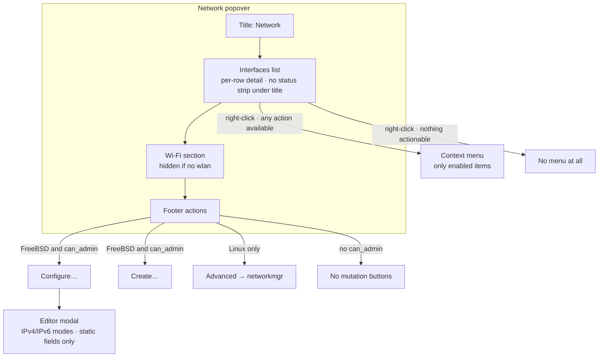

# Panel Network Control — Plan (FreeBSD-first)

**Maintainer:** REVYTECH, Inc.  
**Repo:** [github.com/revytechinc/wf-shell](https://github.com/revytechinc/wf-shell)  
**Branch:** `feature/panel-network`  
**Status:** Wiring design + mockup; FreeBSD probe/Factory started  
**Runtime target:** FreeBSD-centric — **we own the FreeBSD network control plane in-process**  
**Also:** Linux keeps **real** NetworkManager D-Bus; FreeBSD does **not** shim NM.

---

## 0. Decision: FreeBSD network manager (in-tree)

We **will implement our own FreeBSD network manager** as a library inside `wf-shell`
(same process as the panel), not as a NetworkManager clone or a D-Bus compatibility layer.

| | FreeBSD (ours) | Linux (upstream path) |
|--|----------------|------------------------|
| **Product name (concept)** | `FreeBSDNetworkService` / `INetworkBackend` FreeBSD product | NetworkManager via D-Bus |
| **Where it lives** | `src/util/network/` (Factory product) | existing `manager.cpp` NM path |
| **Sources of truth** | kernel + base tools | NM daemon |
| **UI** | panel tray + popover (mockup) | existing NM widgets |
| **Privilege** | best-effort unprivileged read; actions may need root/doas | NM polkit |

### What “our own manager” means (and does **not**)

**Is:**

1. **Read path (v1)** — continuous truth from FreeBSD:
   - `getifaddrs` / iface groups / media / status  
   - default route + gateway  
   - fingerprint → signals (no spam)  
   - primary selection for tray  
2. **Policy path** — which ifaces to show (hide lo, optional bridge/tap via Builder/ini)  
3. **Action path (v2+)** — small, explicit ops when allowed:
   - `ifconfig <if> up|down`  
   - `wpa_cli` scan / select / disconnect (if `wlan*` + wpa)  
4. **Config editor (FreeBSD)** — modal UI writing `sysrc` / `rc.conf` keys  
   (`ifconfig_IF`, `ifconfig_IF_ipv6`, optional gateways) via `doas`/`sudo`  
   (host policy, not shipped in the repo).  
   - **DHCP** → no manual `defaultrouter` (lease provides gateway).  
   - **SLAAC / accept_rtadv** → no manual `ipv6_defaultrouter` (RA provides routes).  
   - **Static** → address/prefix + optional gateway fields.  
5. **Feature autodetection** — same spirit as audio `features()`  
6. **Privilege gate** — probe root / `doas -n` / `sudo -n` before any mutation.  
   - **Has admin** → Configure / Create / Turn on|off / Delete enabled.  
   - **No admin** → **information-only mode**: tray + iface list + status only;  
     no editor save, no create/destroy, no up/down. Never crash; never pretend.  

**Linux-only:** NetworkManager D-Bus + optional **Advanced** → `networkmgr`.  
**FreeBSD:** no NetworkManager chrome; no networkmgr Advanced button.

**Is not:**

- A system-wide daemon replacing `wpa_supplicant` / `dhclient` / `netif`  
- NetworkManager D-Bus API compatibility on FreeBSD  
- Full routing / firewall / jail networking IDE  
- Reimplementing DHCP in the panel  

Privileged work stays with **base tools** (`ifconfig`, `sysrc`, `wpa_cli`, `dhclient`). We orchestrate and present.

### Why

- FreeBSD has **no** NetworkManager as the normal desktop path.  
- Fake NM object paths and GNOME control-center were a dead end.  
- Factory/Builder already isolates FreeBSD; the “manager” is that product grown up.  
- Sound Settings proved the pattern: **OS-native stack + sparse UI + fail-soft**.

### Layering (target)



Name in code can stay `FreeBSDNetworkBackend` until it grows; docs call it the
**FreeBSD network service** so we do not confuse it with GNOME NetworkManager.

---

## 1. Problem

Tray **network** next to sound is NM-shaped:

- Linux: NetworkManager + Wi‑Fi AP list works  
- FreeBSD: thin `getifaddrs` poll; tray often wrong primary; popover has no FreeBSD story  
- Right-click default was GNOME control center (useless here)  
- `is_active()` was non-virtual → crash risk on FreeBSD devices  

We already started: **Factory/Builder**, `wf_net::probe_interfaces()`, primary from **default route**, richer display names. Icons for bridge/tap fixed to theme-available names.

---

## 2. FreeBSD wiring (how data moves)



### Privilege gate



### Autodetect features (same idea as audio `features()`)

| Flag | True when | UI |
|------|-----------|-----|
| `physical_ifaces` | any non-lo iface | interface list |
| `default_route` | `route get default` has interface | tray primary |
| `wireless` | any `wlanN` present | Wi‑Fi section |
| `wpa` | `wpa_cli` + control socket | scan/join controls |
| `can_admin` | root / doas / sudo present (including password-required) | mutations offered |
| `needs_password` | elevator exists but `-n` fails | **auth dialog** before apply |
| information-only | no root and no doas/sudo binary | list + tooltip only |
| `config_editor` | FreeBSD **and** `can_admin` | **Configure…** modal |
| `create_iface` | FreeBSD **and** `can_admin` | **Create…** + preflight |
| `advanced_gui` | Linux + `networkmgr` / ini | **Advanced** (hidden on FreeBSD) |

**Only show sections that probe true.** No fake Wi‑Fi on a wired-only box.

### Fingerprint / no rebuild if unchanged

| Object | Fingerprint |
|--------|-------------|
| Interface row | name + up/running + addrs + media + default |
| Primary | default-route iface path |
| Wi‑Fi scan list (later) | BSSID+SSID+signal set |

Same Honcho rule as audio: **diff before paint**.

---

## 3. Goals — “all the things” (phased)

### v1 — wired / multi-NIC status (this mockup)

1. Tray: correct **primary** (default route), icon, short label (iface or IP).  
2. Popover **Network**: status strip (gateway, primary, link).  
3. List **interfaces** FreeBSD knows about (eth, bridge, tap — filter via Builder).  
4. Per-iface: kind, IPs, media/status, **default** badge.  
5. FreeBSD **Configure…** → modal editor (rc.conf / sysrc); **not** networkmgr.  
6. Linux **Advanced** → networkmgr / ini only.  
7. No NM global toggles / fake AP list on FreeBSD.

### v2 — Wi‑Fi + wpa_supplicant (when `wlan*` + `wpa_cli`)

7. **Scan** — `wpa_cli -i wlanN scan` / `scan_results`  
8. **Signal icons** — Adwaita `network-wireless-signal-*-symbolic` + lock overlay  
9. **Join** — open / WPA-PSK / WEP key dialog (validated)  
10. **Modify wpa_supplicant** — prefer `wpa_cli` control interface, then `save_config`:

```text
wpa_cli -i wlan0
> add_network
> set_network N ssid "MyNet"
> set_network N key_mgmt WPA-PSK          # or NONE / WEP...
> set_network N psk "passphrase"          # WPA 8–63 or 64 hex
> set_network N wep_key0 "...."           # WEP only
> enable_network N
> select_network N
> save_config                             # always — not a UI toggle
```

| Security | wpa_supplicant fields |
|----------|------------------------|
| Open | `key_mgmt=NONE` |
| WPA/WPA2/WPA3-Personal | `key_mgmt=WPA-PSK` + `psk=` |
| WEP | `key_mgmt=NONE` + `wep_key0=` + `wep_tx_keyidx=0` |

**Always persist:** every successful join/update runs `save_config` (no  
“save to conf?” checkbox — that is the product’s job). Host conf should have  
`update_config=1`. If save fails, still try runtime connect; surface a short  
error only when needed.  
Elevation: same admin gate when the control socket or conf is root-owned.

**Do not** ship a project `doas.conf`; do not rewrite conf by hand if `wpa_cli`  
works. Fail-soft on scan/join errors.

### Common Wi‑Fi failures (handle in UI)

| Issue | Detection (FreeBSD) | User action |
|-------|---------------------|-------------|
| **Password changed / wrong PSK** | `CTRL-EVENT-SSID-TEMP-DISABLED` / auth failures; network not ASSOCIATED | Re-open join with **key prefilled** from wpa_supplicant; user edits; update `psk` / `wep_key0`; **Forget network** |
| **Saved network won’t reconnect** | `list_networks` has SSID but not CURRENT after enable | Offer **Update password** or **Forget** |
| **Open network** | scan flags lack privacy | Connect without key dialog |
| **Out of range** | missing from `scan_results` | Keep saved; show “not in range” if user tries join |
| **WEP vs WPA mismatch** | auth fails after key set | Allow changing Security in join dialog |
| **save_config fails** | `update_config=0` in conf | Toast: could not persist; still try runtime select |

**Never** leave a greyed-out empty menu. On bad_key: show the AP as **password invalid** and open the key dialog with the **saved key filled in** and a clear error (edit, don’t retype from scratch; no raw wpa_cli spam).

**Network key field:** when a network is already in wpa_supplicant, prefill the key  
from the stored credentials so the user can correct a changed password without  
starting empty.

### v3 — actions / policy

**Status:** design + mockup + pure helpers/tests. **Apply path (run ifconfig create/destroy/up/down) deferred.**

10. **Right-click** on interface row (detect live state)  
11. **Create…** cloned types  
12. **Preflight** before create  
13. Unit tests for pure parsers, preflight catalog, destroyable rules  

See **§3.1** for the full action design. Mockup: right-click + Create + knobs for gif-missing / no-admin.

---

## 3.1 Interface actions (right-click · Create · preflight)

### Context menu (per interface row)



| Item | State detection | Planned apply | Gate |
|------|-----------------|---------------|------|
| **Turn off** | `InterfaceInfo.up == true` → label “Turn off” | `ifconfig IF down` | `can_admin` |
| **Turn on** | `InterfaceInfo.up == false` → label “Turn on” | `ifconfig IF up` | `can_admin` |
| **Configure…** | always (when FreeBSD + admin) | editor → sysrc | `config_editor` |
| **Details…** | always (read-only) | full props + traffic histogram | always |
| **Delete interface…** | `is_destroyable_iface(name)` | `ifconfig IF destroy` | `can_admin` + destroyable |

**Details…** shows everything known about the interface (addresses, media, speed,  
gateways, state) and a live **RX/TX histogram** with auto-scaled units  
(Mbps/Gbps and B/s…GB/s). Counters from `netstat -I` / ifmib; rates from  
deltas. Information-only mode still gets Details (no mutations).

Label comes from **live probe flags**, not a stale toggle. Status is **colour**, not text:  
**green = up** · **red + greyed row = down**. Never “admin down” wording.

### Destroyable vs permanent

| May delete (`ifconfig IF destroy`) | Must **not** delete |
|------------------------------------|---------------------|
| `tapN`, `tunN`, `bridgeN`, `gifN`, `greN` | Physical NICs: `aq0`, `igb0`, `em0`, … |
| `vlanN`, `laggN`, `epairNa/b`, `vxlanN` | System loopback `lo0` |
| `loN` (N≥1), `wgN`, `stfN`, `vmnetN` | |
| `vm-*` (bhyve groups / ports) | |
| Cloned `wlanN` | Parent radio hardware (not listed as wlan unit alone if permanent — UI treats `wlanN` as destroyable clone) |

Pure helper: `wf_net::is_destroyable_iface(name)` — unit-tested; no I/O.

### Create… catalog

UI offers the **intersection** of:

1. Static known catalog (`known_clone_types()`): tap, tun, bridge, gif, gre, vlan, lagg, epair, vxlan, wg, lo, stf  
2. Live `ifconfig -C` (what this kernel currently registers)  
3. Preflight OK (module present / loadable / already in `-C`)

| Type | Typical module | Notes |
|------|----------------|-------|
| tap / tun | `if_tuntap` | VM / tunnel |
| bridge | `if_bridge` | |
| gif | `if_gif` | Often missing if module not installed |
| gre | `if_gre` | |
| vlan | `if_vlan` | |
| lagg | `if_lagg` | |
| epair | `if_epair` | Creates pair (a/b) |
| vxlan | `if_vxlan` | |
| wg | `if_wg` | WireGuard |
| lo | (kernel) | clone loopback |
| stf | `if_stf` | 6to4 |

Optional name field: empty → kernel assigns (`tap0`, `bridge1`, …).

### Preflight (before Create is enabled)



| Input | Source |
|-------|--------|
| clone catalog | `ifconfig -C` |
| module loaded | `kldstat` → `kldstat_has_module` |
| module file | `access(/boot/kernel/if_*.ko)` / `/boot/modules/` |
| admin | `probe_admin_privilege` |

Pure decision: `evaluate_create_preflight(...)`.  
Live: `probe_create_preflight(type)` / `probe_create_catalog()`.

**Sparse UI rule:** if a type is listed in Create… and Create is enabled, preflight already passed.  
**Do not** show “module X available · ifconfig …” (or any green status strip).  
Types that fail preflight are **omitted** from the menu (not shown disabled with a lecture).  
Mockup knob “Simulate gif module missing” simply drops `gif` from the Type list.

### Password dialog (NeedsPassword)

When `doas`/`sudo` exists but non-interactive (`-n`) fails:

1. Still show Configure / Create / context actions (not information-only).  
2. On first mutation (Save, Create, Turn on/off, Delete), open **Authentication required**.  
3. Validate password non-empty; on success continue the pending action (ticket/cache later).  
4. Cancel abandons the pending action.  

No doas/sudo at all → information-only (no dialog).

### Input validation (all editable fields)

| Surface | Rules (pure helpers) |
|---------|----------------------|
| Create name | empty=auto; else IFNAMSIZ iface name; not already taken |
| Configure IPv4 static | address required + dotted quad; prefix 0–32; gateway optional IPv4 |
| Configure IPv6 static | address required + IPv6 (`%zone` ok); prefix 0–128; gateway optional |
| Configure DHCP / SLAAC / none | address/gateway fields not required (hidden) |
| Auth password | non-empty (max length) |

Invalid fields: inline error under the field, **Save/Create/Authenticate disabled path** (button no-op until valid).  
Never ship shell/command strings as validation copy.

### Apply path (deferred — not in this milestone)

Backend still uses base tools under the hood.  
**UI never displays those commands** as instructional text, titles, or success banners.

Elevation: `AdminPrivilege` including `NeedsPassword` + dialog. Host policy not in repo. Fail-soft; never crash.

### Pure API surface (implemented)

| Symbol | Role |
|--------|------|
| `is_destroyable_iface` | Delete menu enable |
| `toggle_action_label` | Turn on / Turn off text |
| `known_clone_types` / `find_clone_type` | Create catalog |
| `parse_ifconfig_clone_list` | Parse `ifconfig -C` |
| `kldstat_has_module` | Module loaded? |
| `evaluate_create_preflight` | Pure gate |
| `probe_create_preflight` / `probe_create_catalog` | Live FreeBSD probe |

---

## 4. UI layout (popover — sparse)



**Tray:** icon only (activity colour); tooltip + popover hold detail.

**Config (ini / wcm only):** show bridges/taps, poll interval, onclick command — not a toggle wall in the popover.

---

## 5. Mockup

| File | Purpose |
|------|---------|
| [mockup.html](mockup.html) | Click-through FreeBSD Network popover + editor/create/ctx |
| [diagrams/tray-icon-only.svg](diagrams/tray-icon-only.svg) | Tray: icon only, activity colour |
| [diagrams/popover-interfaces.svg](diagrams/popover-interfaces.svg) | FreeBSD popover (no NM / no status strip) |
| [diagrams/popover-context-menu.svg](diagrams/popover-context-menu.svg) | Right-click: up/down · configure · delete |
| [diagrams/modal-configure.svg](diagrams/modal-configure.svg) | Configure… static/DHCP editor |
| [diagrams/modal-create-preflight.svg](diagrams/modal-create-preflight.svg) | Create… lists only available types |
| [diagrams/modal-auth-password.svg](diagrams/modal-auth-password.svg) | Password when doas/sudo needs it |
| [diagrams/modal-wifi-join.svg](diagrams/modal-wifi-join.svg) | Wi‑Fi join · WPA/WEP key · wpa_supplicant |
| [diagrams/modal-iface-details.svg](diagrams/modal-iface-details.svg) | Details… + RX/TX histogram |
| [diagrams/information-only.svg](diagrams/information-only.svg) | No doas/sudo — read-only list |
| [ARCHITECTURE.md](ARCHITECTURE.md) | Factory/Builder + Mermaid wiring |

Open locally:

```sh
xdg-open docs/network-control/mockup.html
# or
firefox docs/network-control/mockup.html
```

---

## 6. Acceptance

### v1 (status / Configure UI)

- [ ] Tray primary matches `route -n get default` interface  
- [ ] Popover lists real FreeBSD ifaces with IP/media  
- [ ] No NM-only chrome when backend is FreeBSD  
- [ ] Wi‑Fi section absent without wlan  
- [ ] Fingerprint skip on unchanged poll  
- [ ] FreeBSD: Configure… opens our editor modal (no networkmgr)  
- [ ] Linux: Advanced may open networkmgr  
- [ ] Editor writes/preview sysrc keys; elevate via doas/sudo  
- [x] gtest for classify / route parse / primary pick  

### v3 actions (design + pure helpers now; apply deferred)

- [x] Design: right-click Turn on/off from live `up` flag  
- [x] Design: Delete only when `is_destroyable_iface`  
- [x] Design: Create catalog + preflight (omit unavailable; no command banners)  
- [x] Design: password dialog when doas/sudo needs a password  
- [x] Pure input validation (names, IPv4/6, prefix, config/create, password)  
- [x] Mockup: context menu · Create · auth · validation · admin modes  
- [x] Pure gtest: destroyable, preflight, validation, privilege helpers  
- [x] Coverage script `docs/network-control/tests/coverage.sh` (~96% pure/probe)  
- [ ] UI wires context menu + Create + auth + validation to live GTK  
- [ ] Apply path via admin (after sign-off)  

---

## 7. Collaboration

- Branch + commit + push OK; **no PR unless asked**  
- Author: Mark LaPointe \<mark@cloudbsd.org\>  
- Docs update with behaviour changes  
